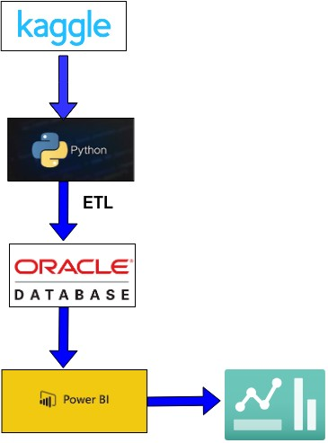

# Employee Data Analysis Project

## Overview

This project presents an end-to-end employee data analysis pipeline starting from data acquisition to final business insights visualization. The objective is to understand salary distribution, department-wise trends, and other key HR metrics to assist decision-making.

---

## 🔗 Project Workflow

1. **Data Acquisition**  
   - Source: [Kaggle - Employee Salary Data](https://www.kaggle.com/datasets/youvolvedata/employee-salary-data)  
   - Format: CSV  

2. **Data Cleaning & Preprocessing**  
   - Tool: Python (Pandas)
   - Operations Performed:
     - Handling missing values
     - Normalizing column formats
     - Filtering out invalid entries
     - Data type conversions

3. **Database Integration**  
   - Database: Oracle 21c XE  
   - Process:
     - Created required schemas and tables
     - Inserted cleaned data using SQL*Loader or Python with cx_Oracle
     - Validated data types and indexes

4. **Data Visualization**  
   - Tool: Microsoft Power BI  
   - Connected to Oracle Database  
   - Created interactive dashboards to show:
     - Department-wise salary distribution
     - Average salary by education level
     - Gender distribution
     - Experience vs Salary trends

---

## 💻 Technologies Used

- **Python** (Pandas, NumPy)
- **Oracle Database XE**
- **Power BI**
- **Kaggle API** (for dataset access)

---

## 📊 Sample Insights

- Departments with the highest average salary
- Correlation between education and salary
- Gender-wise salary gap (if applicable)
- Salary range across locations

---

## THE ENTIRE PIPELINE FOR THE PROJECT IS AS FOLLOWS

